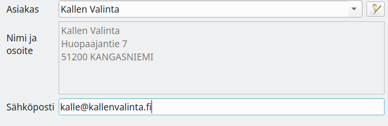
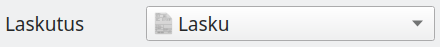
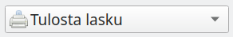
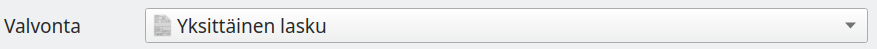
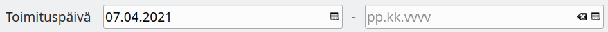
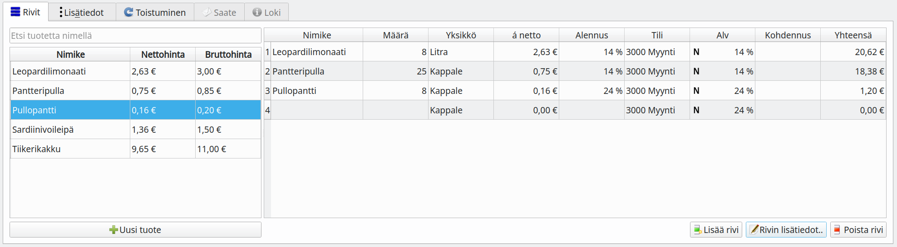

### Asiakkaan tiedot

- Voit valita asiakkaan, joka on jo asiakasrekisterissä
- Asiakkaan nimen oikealla puolella olevalla painikkeella voit lisätä uuden asiakkaan asiakasrekisteriin
- Voit myös kirjoittaa yksittäisen laskun ilman, että asiakasta lisätään asiakasluetteloon, kirjoittamalla asiakkaan nimen ja osoitteen.

### Laskun tyyppi

Lasku
: Tavallinen lasku, joka kirjataan kirjanpitoon laskun päivämäärällä

Käteinen
: Kuitti käteismyynnistä, joka kirjataan suoraan käteiskassaan

Ennakkolasku
: Lasku ennakkosuorituksesta, jolloin arvonlisävero suoritetaan kun lasku maksetaan.

Suoriteperusteinen lasku
: Lasku kirjantaan kirjanpitoon toimituspäivämäärällä

Kuukausittainen lasku
: Lasku toistuu samansisältöisenä kuukaudesta toiseen, tavallisesti vastike tai vuokra

### Laskun toimitustapa

Tulosta lasku
: Lasku tulostetaan

Postita lasku
: Jos postituspalvelu on otettu käyttöön, toimitetaan lasku postituspalveluun, muuten lasku tulostetaan.

Lähetä sähköpostilla
: Lasku lähetetään sähköpostin liitetiedostona. **Saate**-välilehdelle voit kirjoittaa sähköpostiviestin sisällön ja valita, lisätäänkö viestiin maksutiedot (summa, viitenumero, pankkitili, eräpäivä ja virtuaaliviivakoodi)

Verkkolasku
: Lasku toimitetaan verkkolaskuna

Tallenna pdf-tiedostoon
: Lasku tallenetaan pdf-tiedostona, jonka voi esimerkiksi lähettää erillisellä sähköpostiohjelmalla

Ei tulosteta
: Lasku tallennetaan kirjanpitoon ilman että sitä tulostetaan.

{}
Kaikki toimitustavat eivät välttämättä ole käytettävissä. Esimerkiksi verkkolaskutus edellyttää, että verkkolaskutuksen asetuksen on tehty ja asiakkaalle on määritelty verkkolaskuosoite.
{}

### Valvonta

Yksittäinen lasku
: Tavallinen lasku, jonka maksamista valvotaan viitenumerolla

Asiakas
: Asiakaskohtainen viite. Ohjelma seuraa asiakaskohtaisten laskujen saldoja siten, että maksu kohdistuu aina asiakkaan vanhimpaan maksuun. Tämä vaihtoehto on käytettävissä vain pilvikirjanpidossa ja näytetään, kun laskulle on valittu asikasrekisterissä oleva asiakas.

Huoneisto
: Huoneistokohtainen viite. Ohjelma seuraa huoneistokohtaisten laskujen saldon siten, että maksu kohdistuu aina vanhimpaan maksuun. Tämä vaihtoehto on käytettävissä vain pilvikirjanpidossa ja näytetään, kun huoneistoja on määritelty.

Vakioviite
: Ohjelma tiliöi vakioviittellä tulevat suoritukset erikseen määritellylle tilille. Maksun suorittamista ei valvota.

Valvomaton
: Laskua ei kirjata myyntisaataviin eikä sen maksamista valvota. Voi käyttää sellaisten laskujen tulostamiseen, jotka kirjataan vasta maksuperusteisesti.

### Toimituspäivämäärä tai laskutusjakso

Toimituspäivämäärä
: Täytä ainoastaan vasemmanpuoleinen päivämäärä

Laskutusjakso
: Täytä molemmat päivämäärät (esimerkiksi tilauksen tai vuokran laskutusjakso)

### Netto- tai bruttolaskenta

-painikkeen ollessa valittuna laskulle merkitään verolliset rivisummat, muuten rivisummat ovat verottomia ja vero lisätään vasta verottoman välisumman jälkeen, mikä on tavanomainen käytäntö yritysten välisessä kaupassa. Oletuksena verolliset rivisummat näytetään kun asiakkaana on yksityishenkilö eli asiakkaalla ei ole Y-tunnusta.

### Laskun rivit

