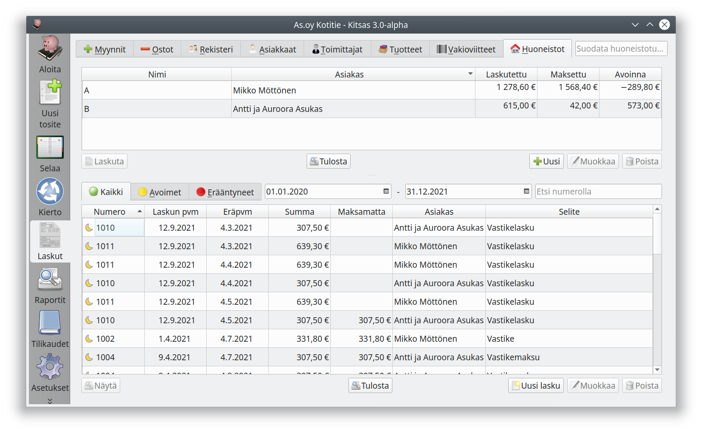

{}
<i class="fas fa-cloud"></i> Huoneistot ovat käytettävissä vain, kun kirjanpito tallennetaan Kitsaan pilveen.
{}

Kitsaalla on mahdollista kohdistaa vuokra tai vastike huoneistoon. Tällöin ohjelma merkitsee maksun saapuessa aina vanhimmat maksamattomat huoneistoon kohdistuvat laskut maksetuiksi.

Tässä näkymässä voit muokata huoneistoja, seurata huoneistoihin kohdistettuja maksuja sekä laskuttaa vuokria tai vastikkeita.
