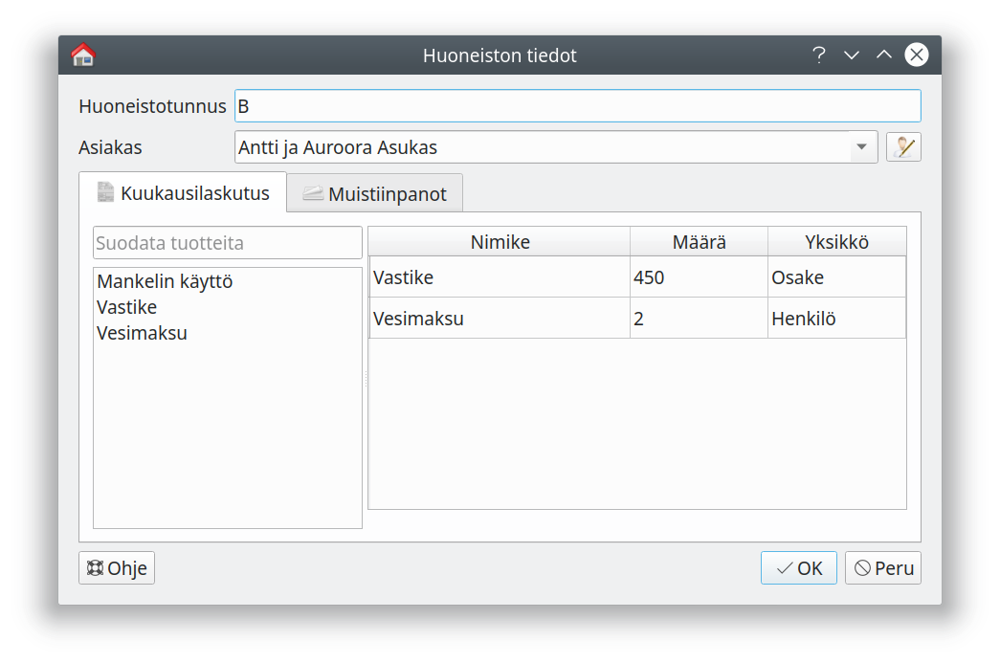
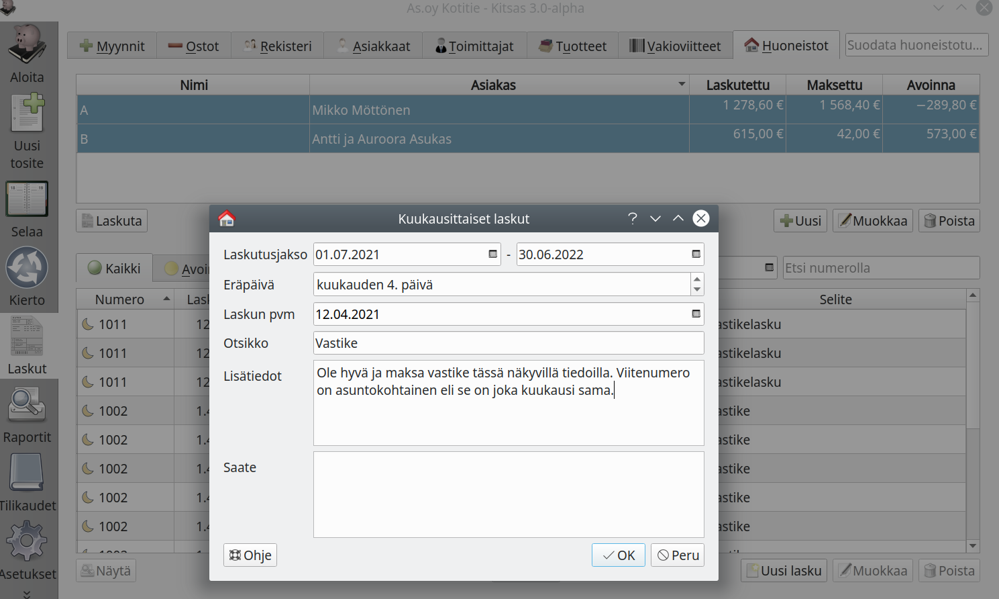
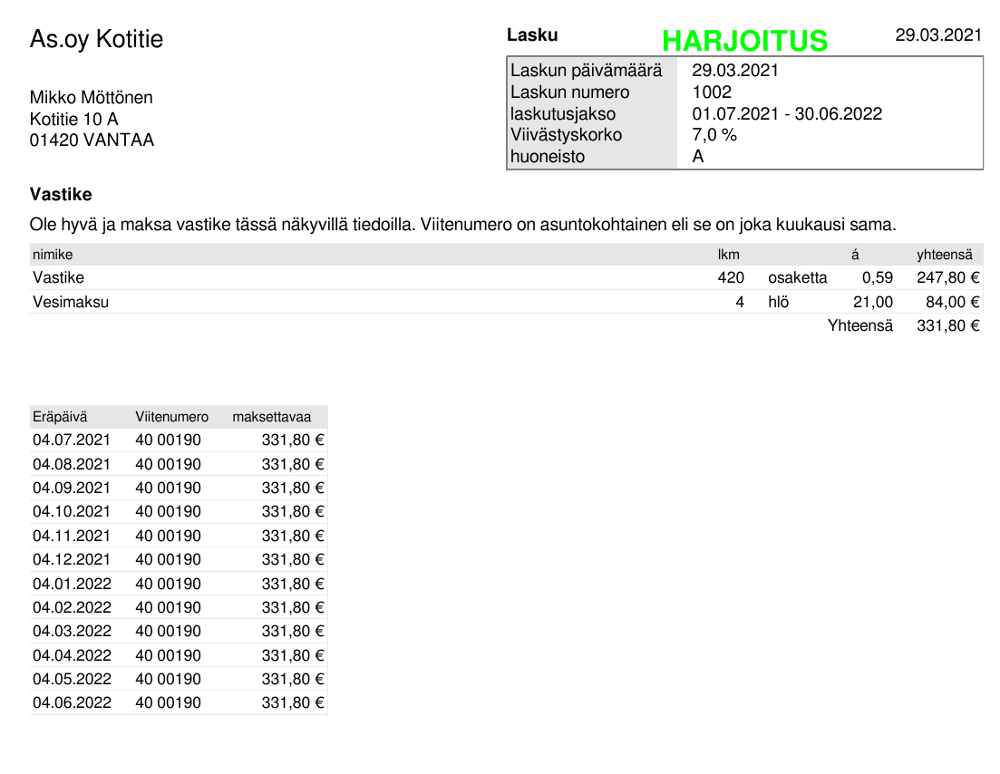

#### Tuotteiden lisääminen

Lisää ensin vastike/vuokra, vesimaksu yms. laskutettavat maksut [tuoterekisteriin]().

#### Huoneistojen tiedot

Lisää ohjelmaan [huoneistot]() ja huoneistoille asukkaat sekä kuukausittain laskutettavat maksut.

#### Laskujen muodostaminen

Valitse huoneistoluettelosta huoneistot, joita laskutat, ja paina **Laskuta**-painiketta.

Valitse **Laskutusjakso** sekä **kuukausittainen eräpäivä** ja täydennä laskulle tulostuvat tiedot. Kun valitset **OK**, laskut muodostetaan **Myynnit** / **Lähtevät** -välilehdelle. Voit vielä muokata yksittäisiä laskuja ennen kuin lähetät ne.

#### Laskujen lähettäminen

Valitse lähetettävät laskut **Lähtevät**-välilehdellä ja paina **Lähetä**.

#### Vastikelaskun malli

{}
Voit kohdistaa huoneistoihin myös yksittäisiä laskuja valitsemalla laskulle [valvonnaksi]() **Huoneisto**.
{}
