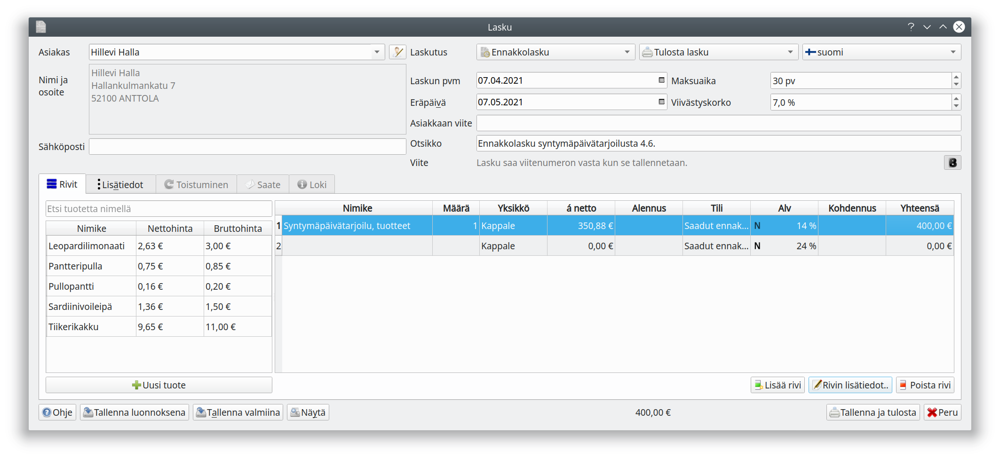

Ennakkolasku kirjataan _Saadut ennakot_-tilille. Arvonlisävero puolestaan kirjataan kun laskusta maksetaan ja myös ilmoitetaan sillä alv-kaudella, millä lasku on maksettu.

Uudella laskulla valitse ensin rekisterissä oleva asiakas (tai lisää asiakasrekisteriin uusi asiakas), ja valitse laskun tyypiksi **Ennakkolasku**.

Tuotteen toimittamisen yhteydessä laaditaan asiakkaalle varsinainen lasku tuotteineen. Kun asiakkaalle on laskutettuja ennakkoja, on ikkunan alalaidassa **Hyvitä ennakko-painike**. Painikkeesta pääset valitsemaan ennakkolaskun, jota tällä laskulla hyvitetään.

**TÄHÄN KUVA**
