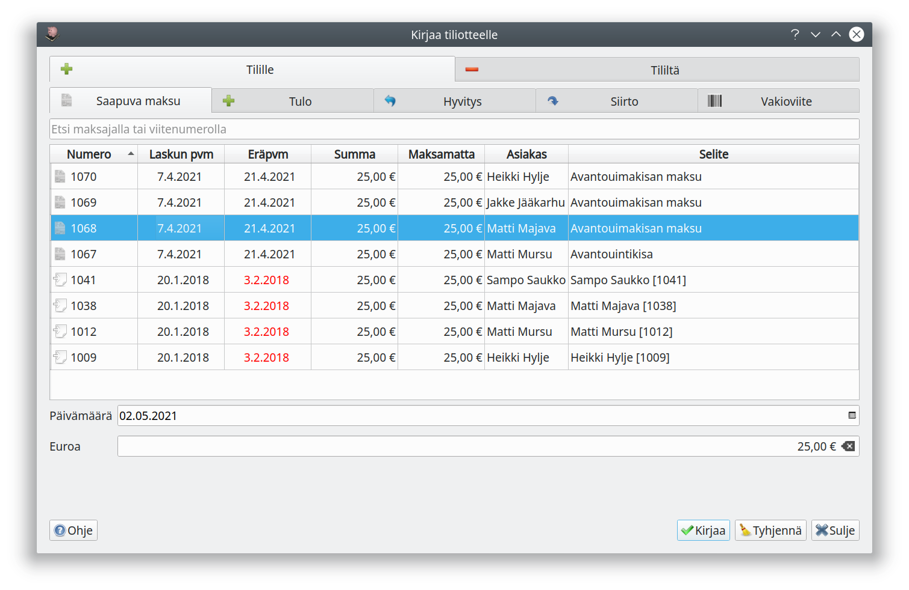
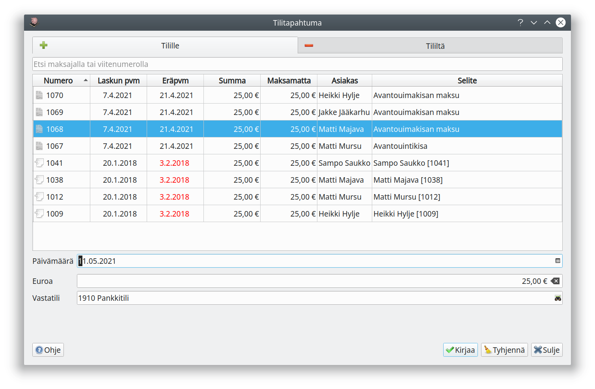
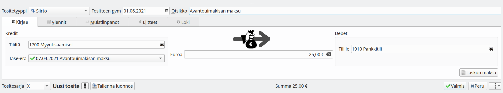

## Tiliotteella

Useimmiten tiliote on se tosite, joka todentaa maksun suorittamisen. Suositeltavin tapa merkitä lasku maksetuksi on tehdä se tiliotetta kirjattaessa.

Tiliotetta sähköisesti tuotaessa Kitsas tunnistaa yleensä automaattisesti useimmat laskut ja merkitsee ne maksetuiksi.

Käsin kirjattaessa valitse **Kirjaa tilitapahtumia** ja **Tilille / Saapuva maksu** tai **Tililtä / Maksettu lasku**. Valitse lasku luettelolta ja merkitse päivä, jolloin lasku on maksettu.

Samalle tiliotteelle voit merkitä kaikki ne laskut, joiden maksaminen näkyy tältä tiliotteelta.

## Siirto-tositteella

Yksittäisen laskun voi merkitä maksetuksi **Siirto**-tositteella. Paina **Laskun maksu**-painiketta. Poimi maksettu lasku luettelosta.

Muista tallentaa tosite!

{}
Jos kirjaat muilla tavoin laskuja maksetuksi niin varmista, että kohdistat maksun oikealle tase-erälle.
{}
