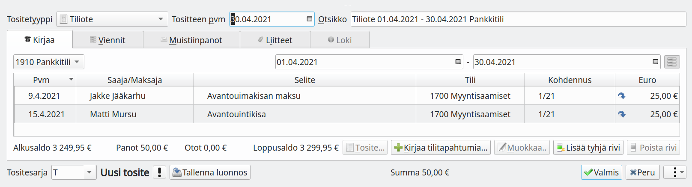

### Tiliotteella

Useimmiten tiliote on se tosite, joka todentaa maksun suorittamisen. Suositeltavin tapa merkitä lasku maksetuksi on tehdä se tiliotetta kirjattaessa.

Valitse **Uusi tosite** ja tositetyypiksi **Tiliote**. Jos sinulla on tiliote sähköisessä muodossa, raahaa se sähköiseksi tositteeksi. Tällöin Kitsas tunnistaa yleensä useimmat laskut ja merkitsee ne maksetuiksi.

Käsin kirjattaessa merkitse tiliotteen päivämäärä ja aikaväli. Paina **Kirjaa tilitapahtumia**.

Kirjataksesi saapuvia maksuja valitse **Tilille / Saapuva maksu** ja maksamillesi laskuille **Tililtä / Maksettu lasku**.

Valitse luettelolta maksettu lasku ja merkitse päivämäärä, jona lasku on tiliotteen mukaan maksettu. Paina **Kirjaa**. Kirjaa samalle tositteelle kaikki tällä tiliotteella näkyvät maksut.

Tallenna lopuksi tiliote sulkemalla _Kirjaa tiliotteelle_-ikkuna ja painamalla kirjausnäkymässä **Valmis**.

### Siirto-tositteella

Yksittäisen laskun voi merkitä maksetuksi Siirto-tositteella.
Valitse **Uusi tosite** ja tositetyypiksi **Siirto**.

Paina **Laskun maksu**-painiketta.

Poimi maksettu lasku luettelosta, merkitse päivämääräksi maksupäivä ja paina **Kirjaa**.

Tallenna tosite painamalla **Valmis**.

{}
Jos kirjaat muilla tavoin laskuja maksetuksi niin varmista, että kohdistat maksun oikealle tase-erälle.
{}
