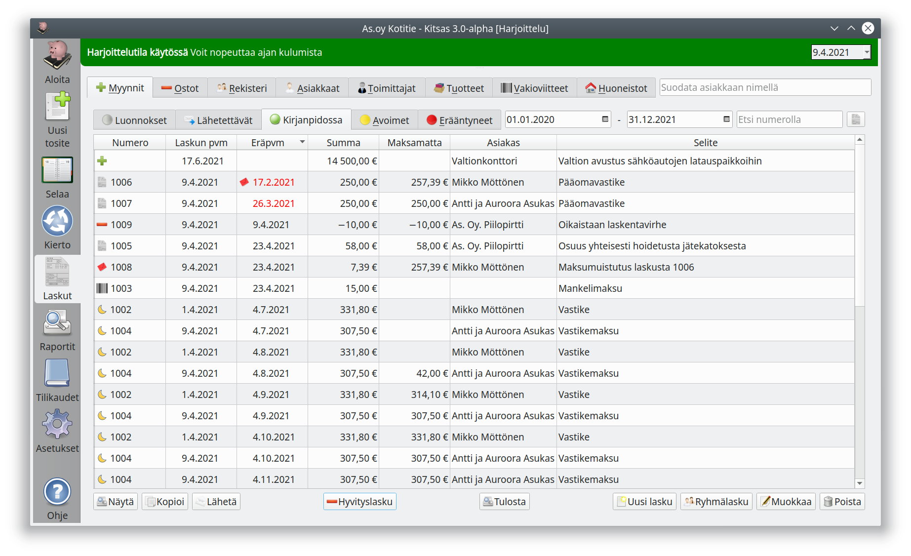

- **Luonnokset**-välilehdeltä löydät laskut, joiden laatiminen on vielä kesken
- **Lähetettävät**-välilehdellä on laskut, jotka ovat valmiina lähetettäviksi. Ne on vielä lähetettävä valitsemalla lähetettävät laskut ja painamalla **Lähetä**.
- **Kirjanpidossa**-välilehdellä ovat kaikki laskut, jotka on viety kirjanpitoon. Kitsaassa myyntilasku saa laskunumeron ja viedään kirjanpitoon vasta, kun se on lähetetty asiakkaalle.
- **Avoimet**-välilehdellä ovat maksamattomat laskut sekä laskut, joilla on ylisuorituksia
- **Erääntyneet**-välilehdellä ovat laskut, joiden eräpäivä on jo mennyt. Tällaiselle laskulle voi laatia [maksumuistuksen]().

{}
Tässä näkymässä voit **muokata** laskua tai **poistaa** jo laaditun laskun. Laskua, joka on jo toimitettu asiakkaalle, ei kuitenkaan pitäisi muokata, koska laskun pitäisi olla samanlaisena sekä asiakkaan että toimittajan kirjanpidossa. Laskun muutoksista pitäisi mieluummin laatia [hyvityslasku]().
{}
