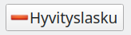
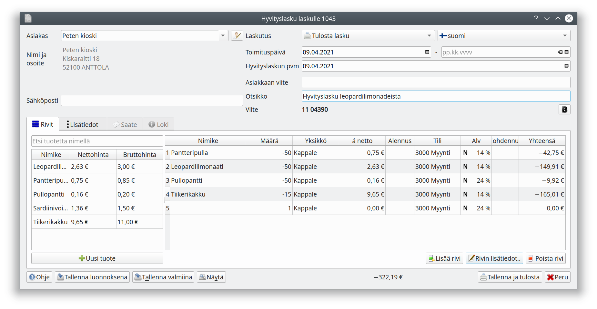
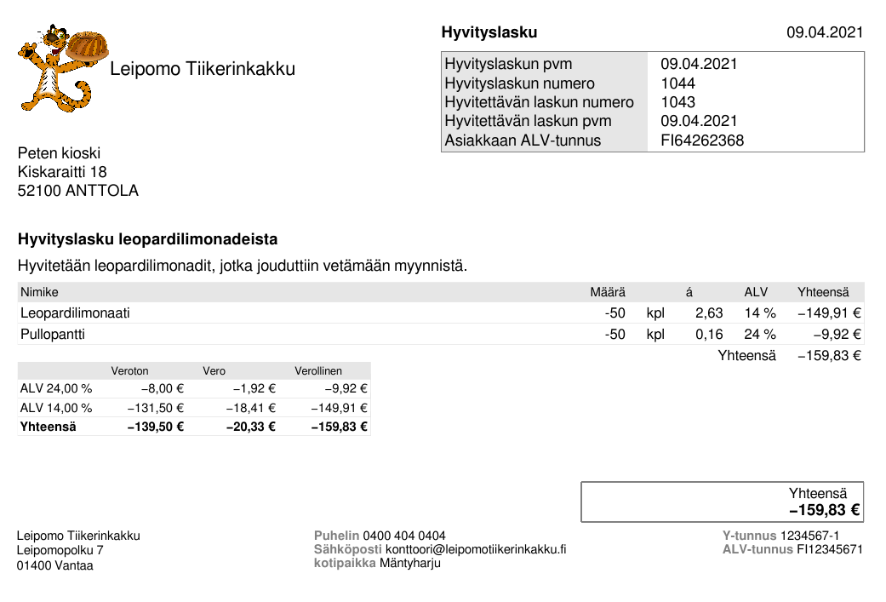

Aloita hyvityslaskun laatiminen valitsemalla hyvitettävä lasku myyntilaskujen näkymässä ja painamalla -painiketta.

Ohjelma luo oletuksena laskun, jolla alkuperäinen lasku hyvitetään kokonaisuudessaan. Jos laskusta hyvitetään vain osa, muokkaa laskun rivejä hyvityksen mukaisesti. Voit myös lisätä lisätietoihin selvityksen hyvityksestä.

Asiakas kirjaa hyvityslaskun omaan kirjanpitoonsa ja maksaa määrän, josta hyvitys on vähennetty.

{}
Jos asiakas on jo maksanut laskunsa ja joudut palauttamaan rahaa asiakkaalle, voit kirjata palautuksen maksetuksi vastaavalla tavalla kuin [ostolasku kirjataan maksetuksi](). Palautettavat laskut ovat välilehdelle **Tililtä / Maksettu lasku**.
{}

#### Hyvityslaskun malli

