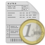

#### Kitsaalla laaditut laskut

| Tunnus                 | Nimi                     | Selitys                                                                                                                           |
| ---------------------- | ------------------------ | --------------------------------------------------------------------------------------------------------------------------------- |
|          | Laskuperusteinen lasku   | Tavallinen lasku. Kirjataan kirjanpidossa laskun päivämäärälle                                                                    |
|        | Suoriteperusteinen lasku | Kirjataan toimituspäivälle                                                                                                        |
|   | Ennakkolasku             | Myyntiä laskutetaan etukäteen.                                                                                                    |
|       | Käteislasku              | Maksu on suoritettu käteisellä                                                                                                    |
|         | Hyvityslasku             | Hyvitetään jo annettua laskua                                                                                                     |
|  | Maksumuistutus           | Punainen kuori eräpäivän vieressä tarkoittaa, että laskusta on laadittu maksumuistutus.                                           |
|           | Asiakaskohtainen lasku   | Laskun maksamista valvotaan asiakaskohtaisella viitteellä niin, että maksun suoritus kohdistuu aina vanhimpaan avoimeen laskuun   |
|           | Huoneisto lasku          | Laskun maksamista valvotaan huoneistokohtaisella viitteellä niin, että maksun suoritus kohdistuu aina vanhimpaan avoimeen laskuun |
|     | Vakioviite               | Saapuvat laskut kirjataan määrätylle tilille. Laskun maksamista ei valvota                                                        |
|     | Valvomaton lasku         | Lasku on laadittu Kitsaalla, mutta laskua ei ole kirjattu myyntisaamisiin eikä Kitsas valvo laskun maksamista                     |

#### Muut tulot

Myyntireskontrassa näytetään myös muut Kitsaalla kirjatut tulot, ellei -painikkeella erikseen valita, että ohjelma näyttää vain Kitsaalla laaditut laskut.

| Tunnus           | Nimi       | Selitys                                                                  |
| ---------------- | ---------- | ------------------------------------------------------------------------ |
|    | Tulotosite | Tulotositteella kirjattu tulo, esimerkiksi muulla ohjelmalla tehty lasku |
|  | Tiliote    | Tiliotteelta kirjattu tulo                                               |
