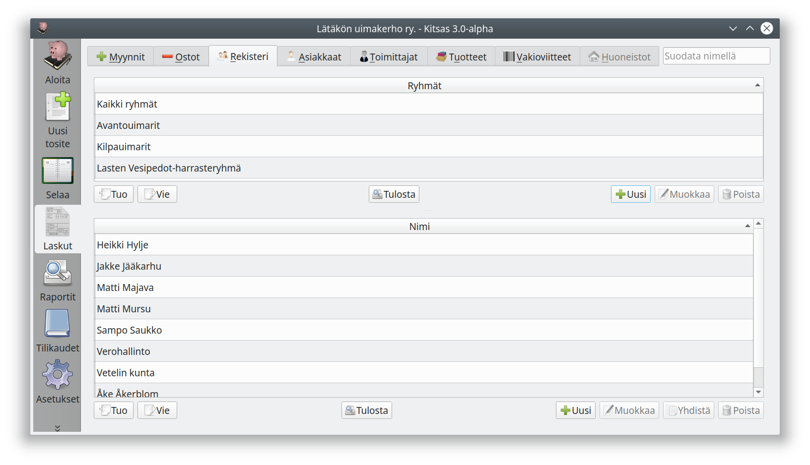

- **Rekisteri**-välilehdellä voit hallinnoida kaikkien asiakas- ja toimittajarekisterissä olevien tietoja sekä muokata ryhmiä.
- **Asiakkaat**-välilehdeltä näet kaikki asiakkaat, jotka on merkitty myyntilaskuihin, sekä heidän laskujensa tilanteen.
- **Toimittajat**-välilehdellä näet kaikki toimittajat, jotka on merkitty ostolaskuihin, sekä heidän laskujensa tilanteen.

{}
Kun luot uuden asiakkaan, näkyvät hänen tietonsa ensin ainoastaan **Rekisteri**-välilehdellä. **Asiakkaat**-välilehdellä tiedot näkyvät vasta, kun asiakas on merkitty johonkin myyntilaskuun.

Voit luoda uuden asiakkaan tai toimittajan myös suoraan tositetta kirjatessasi tai uutta laskua luodessasi.
{}

#### Asiakkaan/Toimittajan valitseminen

Ohjelman eri näkymissä voit valita asiakkaan tai toimittajan

- valitsemalla olemassa olevan asiakkaan/toimittajan valintalistasta
- aloittamalla kirjoittamaan nimeä
- luomalla uuden asiakkaan/toimittajan kentän vieressä olevalla **+**-painikkeella
- luomalla uuden asiakkaan/toimittajan kirjoittamalla nimen
- kirjoittamalla asiakkaan/toimittajan Y-tunnuksen

Nimikentän vieressä olevalla painikkeella pääset muokkaamaan asiakkaan/toimittajan tietoja.
