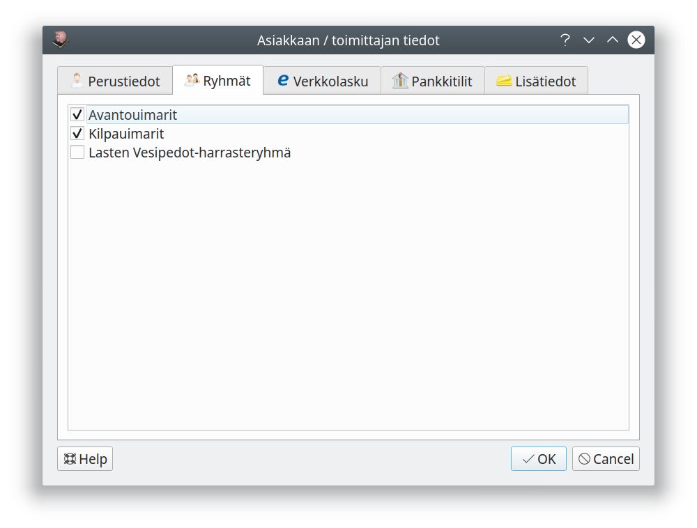

#### Ryhmien muokkaaminen

**Rekisteri** välilehdellä voit

- luoda uusia ryhmiä painamalla ylempää **Uusi**-painiketta
- muuttaa ryhmän nimeä ylemmällä **Muokkaa**-painikkeella
- poistaa ryhmän ylemmällä **Poista**-painikkeella

Kun valitset luettelosta ryhmän, näytetään alemmassa luettossa vain tämän ryhmän jäsenet. Tällöin voit valita ryhmän jäsenet alemmasta luettelosta ja alemmalla **Tulosta**-painkkeella tulostaa jäsenluettelon tai **Vie**-painikkeella viedä tiedostoon mm. ryhmän osoitetiedot.

#### Ryhmien jäsenyys

Muokkaamalla yksittäisen asiakkaan tietoja voit **Ryhmät**-välilehdeltä määritellä ne ryhmät, joihin asiakas kuuluu.

